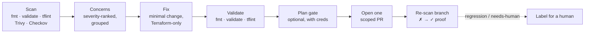

# Terramend

[](LICENSE)
[](https://github.com/terramend/terramend/actions/workflows/test.yml)
[](https://github.com/terramend/terramend/releases)
[](https://github.com/marketplace/actions/terramend)

**Terramend brings your Terraform up to best practice — automatically, as reviewable pull requests.**

Terramend is an open-source ([AGPL-3.0](#licence)) GitHub Action and agent runtime. Point it at a
repository and it scans the Terraform with standard deterministic tools, then opens **one scoped,
reviewable pull request per concern** that fixes the issue and **proves it fixed** by re-scanning the
branch (✗ → ✓). It never auto-merges — a human always reviews.

- **It proves its own fixes.** The PR body records `✗ → ✓ <rule> resolved`, produced by re-running the
  same deterministic scanners on the branch. Anyone can reproduce it — evidence, not a claim.
- **Tools decide, the LLM assists.** Findings come from `terraform fmt`/`validate`, tflint, Trivy and
  Checkov — not the model's opinion. The agent only applies the minimal, constrained fix.
- **One scoped PR per concern.** Small, reviewable diffs on stable `remediate/<id>` branches. Re-runs
  update the existing PR rather than opening duplicates.
- **Guardrails enforced in code, not prompts.** Terraform-only edits, no inlined secrets, no destroying
  stateful data, never auto-merges — all fail-closed at push time.
- **Module-aware.** Fixes land at the module source, version upgrades arrive as scoped `chore(deps)`
  PRs, and resource piles become module calls only when a pure-`moved` plan proves the refactor is a
  no-op.
- **Bring your own key, no hosted backend.** Supply your own LLM key, pointed at an approved endpoint
  where data residency matters. Nothing leaves your runner that you didn't configure.

## Quickstart

```yaml
name: Terramend — Terraform remediation
on:
  workflow_dispatch:
  schedule:
    - cron: "0 6 * * 1" # weekly drift sweep

permissions:
  contents: write       # push the remediation branch
  pull-requests: write  # open the PR

jobs:
  remediate:
    runs-on: ubuntu-latest
    steps:
      # Pin third-party actions to a commit SHA — a tag can be force-repointed.
      - uses: actions/checkout@df4cb1c069e1874edd31b4311f1884172cec0e10 # v6

      # install the Terraform best-practice toolchain (absent tools are skipped, never fatal)
      - uses: hashicorp/setup-terraform@b9cd54a3c349d3f38e8881555d616ced269862dd # v3
      - uses: terraform-linters/setup-tflint@90f302c255ef959cbfb4bd10581afecdb7ece3e6 # v4
      - uses: aquasecurity/setup-trivy@81e514348e19b6112ce2a7e3ecbafe19c1e1f567 # v0.3.1
      - run: pipx install checkov

      - name: Run Terramend
        uses: terramend/terramend@v0
        with:
          mode: remediate
          severity_threshold: medium   # only act on medium+ concerns
          max_prs: 1                   # one scoped PR per run
        env:
          # bring your own LLM key (BYOK)
          ANTHROPIC_API_KEY: ${{ secrets.ANTHROPIC_API_KEY }}
          GITHUB_TOKEN: ${{ github.token }}
```

> **Ready-to-use workflows:** [`examples/`](examples/) has copy-pasteable workflows — scheduled
> [remediation](examples/remediate.yml), [generation](examples/generate-terraform.yml),
> [comment-triggered fixes](examples/comment-fix.yml), and the full
> [SARIF + plan-gate + policy setup](examples/remediate-advanced.yml).

## How it works



**Scanners find the problem, the agent applies the minimal fix, and the scanners verify it** before a
single PR is opened. Coverage is inherited, not reinvented: findings come from the scanners Terramend
runs (Checkov's 1,000+ policies, Trivy's AVD checks, tflint's provider rulesets, `fmt`/`validate`), so
new upstream checks show up the day you update the scanner. The PR's **Validation (✗ → ✓)** section is
the part you can trust without trusting Terramend — re-run the same scanners on the branch and
reproduce it. Higher-risk fixes (a regression, a stateful destroy/replace, a large blast radius, a
non-deterministic plan) get a `> [!CAUTION]` banner and a `needs-human` label.

## How Terramend compares

| | Reports findings | Fixes the code | Proves the fix | Opens a PR | Auto-merges |
| --- | :---: | :---: | :---: | :---: | :---: |
| **Scanners** (Checkov, Trivy, tfsec, tflint) | ✅ | ❌ | ❌ | ❌ | — |
| **Plan orchestrators** (Atlantis, Digger) | ❌ | ❌ | ❌ | comments on yours | ❌ |
| **Dependency bots** (Dependabot, Renovate) | ✅ (deps) | ✅ (version bumps) | ❌ | ✅ | optional |
| **Auto-fix AI bots** | partial | ✅ | rarely | ✅ | often |
| **Terramend** | ✅ | ✅ | ✅ (✗ → ✓ re-scan) | ✅ (one per concern) | **never** |

## Documentation

| Doc | What's in it |
| --- | --- |
| [Action inputs & outputs](docs/action-inputs.md) | The complete `action.yml` reference (generated — never drifts) |
| [Configuration](docs/configuration.md) | Modes, comment-scoped runs, scoping out findings, the plan gate & OIDC roles, BYOK, SARIF, modules |
| [Security model](docs/security-model.md) | The code-level guardrails and the trust/data-privacy story |
| [MCP server](docs/mcp.md) | `terramend mcp` in your IDE + pairing with HashiCorp's terraform-mcp-server |
| [Tools](docs/tools.md) | Every MCP tool the agent uses, and the CLI binaries they shell out to |
| [Supported models](docs/models.md) | The model catalog and how selection works (generated) |

## Support

- **Getting started / usage** — this README, the [docs](docs/), and the [`examples/`](examples/) workflows.
- **Bug reports & feature requests** — open a [GitHub issue](https://github.com/terramend/terramend/issues).
- **Security vulnerabilities** — **don't** use a public issue; see [Security](#security) below.

## Contributing

Contributions are welcome. Terramend standardises on **Node 24** and **pnpm 11**:

```bash
corepack enable
pnpm install --frozen-lockfile
pnpm typecheck
pnpm test
```

All contributions are accepted under the [Contributor License Agreement](CLA.md) (enforced by the CLA
Assistant on your first PR), and releases are automated from [Conventional Commits](https://www.conventionalcommits.org)
via release-please. See [`CONTRIBUTING.md`](CONTRIBUTING.md) for the full development, commit, and
action-pinning conventions.

## Security

Terramend runs AI coding agents with write access to repositories and CI secrets, and is positioned for
security- and compliance-sensitive use. **Please don't open public issues for vulnerabilities** — report
them privately via [GitHub Security Advisories](https://github.com/terramend/terramend/security/advisories/new).
See [`SECURITY.md`](SECURITY.md) for scope, supported versions, and response targets.

## Licence

Terramend is licensed under the **GNU Affero General Public License v3.0 or later** (AGPL-3.0-or-later).
