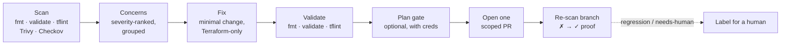

# Terramend

[](LICENSE)
[](https://github.com/terramend/terramend/actions/workflows/test.yml)
[](https://github.com/terramend/terramend/releases)
[](https://github.com/marketplace/actions/terramend)
[](https://scorecard.dev/viewer/?uri=github.com/terramend/terramend)
<!-- OpenSSF Best Practices: register the project at https://www.bestpractices.dev to get a numeric
     project id, then uncomment this line and replace PROJECT_ID with it.
[](https://www.bestpractices.dev/projects/PROJECT_ID)
-->

**Terramend brings your Terraform up to best practice — automatically, as reviewable pull requests.**

Terramend is an open-source ([AGPL-3.0](#licence)) GitHub Action and agent runtime. Point it at a
repository and it scans the Terraform with standard deterministic tools, then opens **one scoped,
reviewable pull request per concern** that fixes the issue and **proves it fixed** by re-scanning the
branch (✗ → ✓). It never auto-merges — a human always reviews.

## Why Terramend

- **It proves its own fixes.** Terramend re-runs the same deterministic scanners on the PR branch and
  records `✗ → ✓ <rule> resolved` in the PR body. Anyone can reproduce it — it's evidence, not a claim
  you have to trust.
- **Tools decide, the LLM assists.** Findings come from `terraform fmt`/`validate`, tflint, Trivy and
  Checkov — not the model's opinion. The agent only applies the minimal, constrained fix.
- **One scoped PR per concern.** Small, reviewable diffs on stable `remediate/<id>` branches. Re-runs
  update the existing PR rather than opening duplicates.
- **Guardrails enforced in code, not prompts.** Terraform-only edits, no inlined secrets, no destroying
  stateful data, never auto-merges — all fail-closed at push time.
- **Bring your own key, no hosted backend.** Supply your own LLM key, pointed at an approved endpoint
  where data residency matters. Nothing leaves your runner that you didn't configure.

---

## Contents

- [Why Terramend](#why-terramend)
- [Quickstart](#quickstart)
- [How it works](#how-it-works)
- [What a Terramend PR looks like](#what-a-terramend-pr-looks-like)
- [How Terramend compares](#how-terramend-compares)
- [Guardrails](#guardrails)
- [Trust & data privacy](#trust--data-privacy)
- [Configuration](#configuration)
  - [Modes](#modes)
  - [Scope a run from a PR/issue comment](#scope-a-run-from-a-prissue-comment)
  - [Inputs](#inputs)
  - [Scope out a finding](#scope-out-a-finding)
- [Cloud credentials & the plan gate](#cloud-credentials--the-plan-gate)
- [Bring your own key (BYOK)](#bring-your-own-key-byok)
- [Report findings to code-scanning (SARIF)](#report-findings-to-code-scanning-sarif)
- [Terraform modules](#terraform-modules)
- [Under the hood](#under-the-hood)
  - [MCP tools the agent uses](#mcp-tools-the-agent-uses)
  - [Required & optional command-line tools](#required--optional-command-line-tools)
- [Support](#support)
- [Contributing](#contributing)
- [Security](#security)
- [Licence](#licence)

---

## Quickstart

Add a workflow that runs Terramend on your Terraform repository. Install the scanner toolchain you want
on the runner's `PATH`; Terramend degrades gracefully (reporting tools *skipped*) when one is absent.

```yaml
name: Terramend — Terraform remediation
on:
  workflow_dispatch:
  schedule:
    - cron: "0 6 * * 1" # weekly drift sweep

permissions:
  contents: write       # push the remediation branch
  pull-requests: write  # open the PR

jobs:
  remediate:
    runs-on: ubuntu-latest
    steps:
      # Pin third-party actions to a full commit SHA, not a moving tag — a tag
      # can be force-repointed at malicious code (cf. the March 2026 Trivy-action
      # compromise). The trailing `# vX` is the human-readable version; Dependabot
      # bumps both. (Terramend flags exactly this pattern in your Terraform CI.)
      - uses: actions/checkout@df4cb1c069e1874edd31b4311f1884172cec0e10 # v6

      # install the Terraform best-practice toolchain
      - uses: hashicorp/setup-terraform@b9cd54a3c349d3f38e8881555d616ced269862dd # v3
      - uses: terraform-linters/setup-tflint@90f302c255ef959cbfb4bd10581afecdb7ece3e6 # v4
      - uses: aquasecurity/setup-trivy@81e514348e19b6112ce2a7e3ecbafe19c1e1f567 # v0.3.1
      - run: pipx install checkov

      - name: Run Terramend
        # `@v0` floats across the v0.x line; for maximum supply-chain integrity
        # pin Terramend to a release commit SHA too (e.g. terramend/terramend@<sha> # v0.1.21).
        uses: terramend/terramend@v0
        with:
          mode: remediate
          severity_threshold: medium   # only act on medium+ concerns
          max_prs: 1                    # one scoped PR per run
          # protected_paths: "prod/**,**/state/**"   # never auto-modify these
          # module_catalogue: |                       # prefer these modules
          #   terraform-aws-modules/vpc/aws ~> 5.0
          #   ./modules/networking
        env:
          # bring your own LLM key (BYOK) — pointed at an approved endpoint if needed
          ANTHROPIC_API_KEY: ${{ secrets.ANTHROPIC_API_KEY }}
          GITHUB_TOKEN: ${{ github.token }}
```

> **Ready-to-use workflows:** [`examples/`](examples/) has copy-pasteable workflows — scheduled
> [remediation](examples/remediate.yml), [generation](examples/generate-terraform.yml),
> [comment-triggered fixes](examples/comment-fix.yml), and the full
> [SARIF + plan-gate + policy setup](examples/remediate-advanced.yml). A complete end-to-end demo
> (a deliberately-flawed module + its remediation workflow) lives in the separate
> [`terramend/terraform-aws-repo-examples`](https://github.com/terramend/terraform-aws-repo-examples) repo.

---

## How it works

Every run follows the same loop — **scanners find the problem, the agent applies the minimal fix, and
the scanners verify it before a single PR is opened**:



1. **Scan** the Terraform in the workspace with deterministic check tools — `terraform fmt`,
   `terraform validate`, [tflint](https://github.com/terraform-linters/tflint),
   [Trivy](https://github.com/aquasecurity/trivy), and [Checkov](https://www.checkov.io/). Each
   finding is normalised into a **concern** with a stable, content-derived `id`, a severity, the
   producing rule, the file/line, and a remediation hint.
2. **Fix** the highest-severity concern with the minimal, correct change, guided by a built-in
   `terraform-best-practices` skill (secure defaults, gold standards, registry/house modules, naming
   and structure conventions). It only ever touches Terraform files.
3. **Validate** the change (`terraform fmt` + `validate` + `tflint`) before opening anything — a PR is
   never opened on Terraform that doesn't pass.
4. **Prove the real-world effect (optional)** — when cloud credentials are present it runs
   `terraform plan` and attaches the change summary, blocks destructive changes to stateful resources,
   scores blast radius, and checks plan stability.
5. **Open one scoped PR per concern**, on a branch named `remediate/<id>` (so re-runs update the
   existing PR rather than opening duplicates), with a body that cites the rule, links its docs,
   explains the fix in plain English, and carries a deterministic **confidence** label.
6. **Prove it** — re-runs the scan on the PR branch and records `✗ → ✓ <rule> resolved` in the PR body
   (or says honestly if a concern didn't clear), plus any **regressions** the fix introduced.

> **Coverage is inherited, not reinvented.** Terramend's findings come from the scanners it runs, so it
> inherits their full, continuously-updated check libraries: [Checkov](https://www.checkov.io/)'s
> 1,000+ policies, [Trivy](https://github.com/aquasecurity/trivy)'s AVD misconfiguration checks,
> [tflint](https://github.com/terraform-linters/tflint)'s provider rulesets for AWS / Azure / GCP, and
> `terraform fmt` / `validate` for style and correctness. New upstream checks show up in Terramend the
> day you update the scanner — there's no separate rule-pack to maintain.

---

## What a Terramend PR looks like

Every fix lands as a small, self-explanatory pull request. The body is built **only** from tool
results — every status line is backed by a scanner or plan output, never a self-report. A typical
single-concern PR reads like this:

```markdown
> [!NOTE]
> Hardened the S3 state bucket — encryption at rest + public-access block. Verified, low blast radius.

**Hardened `main.tf` — S3 encryption + public-access block.**

`Confidence: high` · `Blast radius: low (1 resource)` · `Plan: +0 ~1 -0` · `Idempotent: yes`

## What changed

### 🔒 [`trivy:AVD-AWS-0088`](https://avd.aquasec.com/misconfig/avd-aws-0088) — S3 bucket not encrypted

- **Was** — the bucket had no server-side encryption configured.
- **Changed** — added an `aws_s3_bucket_server_side_encryption_configuration` with `aes256`.
- **Safe because** — encryption-at-rest is transparent to readers/writers; no data is moved or replaced.

## Validation (✗ → ✓)

- ✗ → ✓ `trivy:AVD-AWS-0088` resolved
- ✗ → ✓ `checkov:CKV_AWS_19` resolved
```

The **Validation (✗ → ✓)** block is the part you can trust without trusting Terramend: it's produced by
re-running the same deterministic scanners on the PR branch, so anyone can reproduce it. Branch name is
`remediate/<id>`, so a re-run updates this PR instead of opening a duplicate. Higher-risk fixes (a
regression, a stateful destroy/replace, a large blast radius, a non-deterministic plan) swap the
`> [!NOTE]` banner for `> [!CAUTION]` and get a `needs-human` label.

---

## How Terramend compares

Terramend sits in a different box from the tools it's often compared to — it's the only one that
**detects deterministically, fixes, *and* re-proves the fix as a reviewable PR**:

| | Reports findings | Fixes the code | Proves the fix | Opens a PR | Auto-merges |
| --- | :---: | :---: | :---: | :---: | :---: |
| **Scanners** (Checkov, Trivy, tfsec, tflint) | ✅ | ❌ | ❌ | ❌ | — |
| **Plan orchestrators** (Atlantis, Digger) | ❌ | ❌ | ❌ | comments on yours | ❌ |
| **Dependency bots** (Dependabot, Renovate) | ✅ (deps) | ✅ (version bumps) | ❌ | ✅ | optional |
| **Auto-fix AI bots** | partial | ✅ | rarely | ✅ | often |
| **Terramend** | ✅ | ✅ | ✅ (✗ → ✓ re-scan) | ✅ (one per concern) | **never** |

What's distinctive: **deterministic scanners decide what's wrong** (the LLM only drafts the fix),
**one scoped PR per concern** keeps diffs small and reviewable, the fix is **re-proven by re-scanning**,
and Terramend **never merges** — a human always does.

---

## Guardrails

Terramend's remediation runs are bounded by **code-level** guardrails (not just prompt instructions),
all enforced at `push_branch` / `create_pull_request` and all **fail-closed**:

- **Terraform-only edits.** A push is rejected if the run changed any file outside `allowed_paths`
  (default `**/*.tf`, `**/*.tfvars`).
- **Protected paths.** A push that touched anything matching `protected_paths` is rejected — the inverse
  allow-list for prod state, data-store modules, anything you never want auto-modified.
- **No inlined secrets.** The diff is scanned for hardcoded credentials (AWS keys, PEM blocks, tokens,
  `secret = "literal"` assignments) before push; any hit blocks it. Optionally also runs `gitleaks`.
- **No destroying data.** With cloud credentials, `terraform plan` runs before the push; a fix that would
  **delete or replace a stateful resource** (RDS, S3, EBS, a SQL database, …) is hard-blocked. Opt in
  per-resource with `allow_replace`.
- **Bounded PR volume.** A run opens at most `max_prs` pull requests (default **1**).
- **Severity-driven autonomy.** High-severity *security* fixes (and large-blast-radius fixes) are
  labelled `needs-human` rather than waved through.
- **Never auto-merges.** Terramend has no merge capability — every change is left for human review.
- **Idempotent.** Branch/PR naming is keyed on the concern/rule `id`; an existing PR is updated, not
  duplicated.

---

## Trust & data privacy

Letting an agent touch your infrastructure code is a trust decision. Terramend is built so the answer to
"what happens to my code and who's in control?" is boring and verifiable:

- **Your key, your endpoint — BYOK by default.** Terramend ships with no hosted LLM backend. Your
  Terraform is only ever sent to the provider *you* configure with *your* key (`ANTHROPIC_API_KEY`,
  `OPENAI_API_KEY`, `GEMINI_API_KEY`, …), which you can point at a region-pinned or self-hosted endpoint
  where data residency matters. Terramend stores and retains nothing.
- **Runs in your runner.** Everything happens inside your own GitHub Actions runner — clone, scan, fix,
  plan, push. No code is shipped to a Terramend service; there is no Terramend service in the core flow.
- **Deterministic detection, scoped generation.** The scanners decide what's wrong; the LLM only drafts
  the minimal fix. The model never invents findings, and it only ever sees what it needs to fix them.
- **A human always merges.** Terramend has no merge capability. Every change is a reviewable PR with a
  reproducible ✗ → ✓ proof — you approve it, or you don't.
- **Credentials stay separated.** Only cloud-prefixed env (`AWS_*` / `ARM_*` / `GOOGLE_*`) is passed to
  the `terraform` subprocess for the optional plan gate; your LLM key is never leaked into it. The
  plan-gate role is least-privilege and **plan-only** (see [Cloud credentials](#cloud-credentials--the-plan-gate)).

For vulnerability reporting and supported versions, see [Security](#security).

---

## Configuration

### Modes

**Remediate (default).** Scan existing Terraform and open one scoped ✗→✓ PR per concern, as shown in the
[Quickstart](#quickstart).

**Generate new Terraform.** Pin `mode: generateterraform` and describe the infrastructure in `prompt`.
Terramend writes secure-by-default HCL (pinned versions, parameterised, validated, self-scan-clean),
preferring your `module_catalogue`, and opens one reviewable PR.

### Scope a run from a PR/issue comment

When the bot is mentioned, the comment scopes the run (no workflow edit needed):

- `@terramend fix #<concern-id>` — fix exactly one concern
- `@terramend fix all high-severity` — fix every concern at/above a severity
- `@terramend fix main.tf` — fix one file's group
- `@terramend fix all` — fix everything (still bounded by `max_prs`)

### Inputs

All Terraform inputs are optional; defaults are applied at the consumer so "unset" stays distinct from
an explicit value.

| Input | Default | Description |
|-------|---------|-------------|
| `mode` | (auto) | `remediate` (fix existing) or `generateterraform` (create new). |
| `scan_scope` | `full` | `full` scans the whole workspace; `diff` limits concerns to Terraform changed vs the base. |
| `severity_threshold` | `low` | Minimum concern severity to act on: `critical` / `high` / `medium` / `low` / `info`. |
| `max_prs` | `1` | Maximum remediation PRs opened per run. |
| `allowed_paths` | `**/*.tf,**/*.tfvars` | Comma-separated globs the agent may modify. |
| `protected_paths` | (none) | Comma-separated globs the fixer must **never** modify (inverse of `allowed_paths`). |
| `base_branch` | (default branch) | Branch the PR targets. Set to pin a specific base (e.g. a release branch). |
| `allow_replace` | (none) | Resource addresses (or globs, or `*`/`all`) the fix may destroy/replace. Needs cloud creds for the plan. |
| `autonomy_threshold` | `high` | Minimum severity at which a **security** finding is escalated to `needs-human`. A high blast radius always escalates. |
| `gitleaks` | `false` | `true` to also run the external `gitleaks` binary as a secret scanner (on top of the built-in). Best-effort. |
| `cost_increase_block_usd` | (none) | Monthly USD increase at/above which a fix is escalated to `needs-human` (when infracost runs). |
| `module_catalogue` | (none) | Newline/comma list of approved modules to prefer, each `[name=]<source>[ <version>]` — a registry module (`terraform-aws-modules/vpc/aws ~> 5.0`), a private git library (`git::https://github.com/acme/tf-modules.git//aws/s3?ref=s3-v0.1.2`), or a local/house module (`./modules/net`). |
| `terratest` | `false` | `true` to scaffold a plan-only Go Terratest test + native `*.tftest.hcl` test when generating a reusable module (both plan the module directly — no `examples/` fixture). Widens `allowed_paths` to permit the test files. |

Standard agent inputs (`prompt`, `model`, `timeout`, `cwd`, `push`, `shell`, `token`, `output_schema`) are
also available.

### Scope out a finding

Not every finding should be fixed — a deliberate exception, a false positive, a path you never want
touched. Terramend gives you four ways to scope a run, from coarse to surgical:

- **By path** — list globs in `protected_paths` (e.g. `prod/**,**/state/**`); the fixer is hard-blocked
  from modifying anything that matches.
- **By severity** — raise `severity_threshold` so only concerns at/above a level are acted on.
- **By the scanner's own ignore** — Terramend runs the real scanners, so it honors their inline
  suppressions. An `#checkov:skip=CKV_AWS_19:reason`, a `# tflint-ignore: aws_...`, or a
  `#trivy:ignore:AVD-AWS-0088` comment removes the concern at the source, so Terramend never opens a PR
  for it (and the suppression is reviewable in your code, with its reason).
- **Per run, from a comment** — `@terramend fix #<concern-id>` (or `fix main.tf`, `fix all high-severity`)
  scopes a single run to exactly what you name.

---

## Cloud credentials & the plan gate

Add a **least-privilege, plan-only** cloud credential (`AWS_*` / `ARM_*` / `GOOGLE_*`, ideally an OIDC
role) and Terramend runs `terraform plan` before each push — enabling the destroy-block, blast-radius,
and plan-stability gates. Only cloud-prefixed env is passed to the `terraform` subprocess; your LLM key
is never leaked into it. Without credentials these gates degrade green (skipped, never failed).

### The minimal OIDC role

`terraform plan` needs only to **read** state and provider data — never to create, modify, or destroy.
Grant the narrowest role that lets a plan complete, via short-lived OIDC (no static keys):

- **AWS** — a role assumed via GitHub OIDC (`token.actions.githubusercontent.com`) with **read-only**
  data access (`ReadOnlyAccess`, or a tighter policy covering just the resource types in your config),
  **plus** read/write to the **state backend only** (the S3 state bucket + the DynamoDB lock table).
  Nothing else. Plan never mutates infrastructure, so no `Create*`/`Delete*`/`Put*` on real resources.
- **Azure** — a workload-identity federation app with the **Reader** role on the subscription/RG, plus
  Storage Blob Data Reader/Contributor on the state container. Set `ARM_USE_OIDC=true`.
- **GCP** — Workload Identity Federation with **`roles/viewer`** plus object access to the GCS state
  bucket.

Wire it in the workflow with `permissions: id-token: write` and the cloud's OIDC login action before the
Terramend step:

```yaml
permissions:
  id-token: write   # mint the OIDC token
  contents: write   # open the remediation branch/PR
steps:
  - uses: actions/checkout@v6
  - uses: aws-actions/configure-aws-credentials@v4
    with:
      role-to-assume: arn:aws:iam::<acct>:role/terramend-plan-readonly
      aws-region: eu-west-2
  - uses: terramend/terramend@v0
    with:
      mode: remediate
```

Keep the role **plan-only**: Terramend never `apply`s, and the push-time destroy-block + `allow_replace`
guardrails are the second line of defence even if a plan shows a destructive change.

---

## Bring your own key (BYOK)

Terramend runs the LLM behind a swappable backend. **BYOK is the default** — supply your provider key
(`ANTHROPIC_API_KEY`, `OPENAI_API_KEY`, `GEMINI_API_KEY`, …) as a workflow secret, pointed at an
approved endpoint where data-residency matters. No external service is required for the core
remediation flow.

---

## Report findings to code-scanning (SARIF)

Beyond opening fix PRs, Terramend can publish its scan to the repo's **Security tab**. Have the agent
call `terraform_emit_sarif` (writes `terramend.sarif`), then upload it:

```yaml
- uses: terramend/terramend@v0
  with:
    mode: remediate
- uses: github/codeql-action/upload-sarif@v3
  if: always()
  with:
    sarif_file: terramend.sarif
```

Each concern lands as a code-scanning alert with the right severity and a doc link — the **emit** side of
the same SARIF schema `read_findings` **ingests**.

---

## Terraform modules

Terramend prefers a well-formed module over a pile of raw resources when one cleanly fits — a module
carries the secure defaults for you.

- **Public registry modules.** With no catalogue configured, Terramend prefers a well-maintained public
  module (e.g. the [terraform-aws-modules](https://registry.terraform.io/namespaces/terraform-aws-modules)
  collection — `vpc`, `s3-bucket`, `rds`, `eks`, …), pinned, when generating new infra.
- **Your own / house modules.** List them in `module_catalogue` (a local path like `./modules/net` or a
  private registry ref) and Terramend uses them with their exact variable names, pinned.
- **Module-source-aware fixes.** Terramend reads your `module` call-graph: a concern inside a **local
  module** is fixed once at its source (and the change propagates to every caller); a concern that would
  require editing a **registry/git/remote** module is reported (it lives outside the repo) rather than
  vendored or forked.
- **Tests (opt-in Terratest).** With the `terratest` input on, Terramend scaffolds a plan-only Go
  [Terratest](https://terratest.gruntwork.io/) smoke test **and** a native `*.tftest.hcl` test for a
  reusable module it generates — both plan the module directly (Terramend does **not** generate
  `examples/` fixtures). If the repo already has a Terratest suite, it keeps it consistent with the new
  interface and flags in the PR that the suite should be run. It does **not** run the tests itself (that
  needs Go + real cloud to `apply`) and never weakens an assertion to go green.

---

## Under the hood

### MCP tools the agent uses

| MCP tool | What it does |
|----------|--------------|
| `terraform_scan` | Runs fmt / validate / tflint / trivy / checkov over the workspace → a severity-ranked list of `concerns`, rolled into `groups`. Only `*.tf`/`*.tfvars` are reported. Supports `scan_scope: full \| diff`, `severity_threshold`, and `group_by: file \| rule` (one PR per rule across files). Returns a `batch_plan`, per-group autonomy, and per-concern `doc_url`. Absent scanners are reported *skipped* — never fatal. |
| `terraform_validate` | Fast pre-PR gate (fmt + validate + tflint). **Multi-root aware** — validates every Terraform root (`roots_validated`). Reports the pinned `providers` (name + version + resolved major) and `unknown_arguments` — written arguments not in the **installed** provider's schema that would break `plan` (advisory; `schema_checked: false` when the schema is unavailable). |
| `terraform_plan` | *(needs cloud creds)* **Multi-root aware** — plans every root (`roots_planned`) and aggregates add/change/destroy, the destructive set, blast-radius tier, and plan stability. Degrades green (skips) without credentials. |
| `terraform_verify_remediation` | Re-runs the scanners and partitions the targeted `concern_ids` into `resolved` / `remaining` (the independently re-verifiable ✗→✓ proof — anyone can re-run the same deterministic scanners on the branch and reproduce it), reports `regressions` the fix introduced, and a deterministic `confidence`. |
| `terraform_module_graph` | Parses the repo's `module` blocks into a call-graph (local / registry / git / remote) so a concern inside a **local module** is fixed once at the source, and a concern in a **remote** module is flagged as out-of-repo. |
| `list_modules` | Returns the [`module_catalogue`](#inputs) **plus** house modules auto-discovered in the repo (`discovered_house_modules`), so a fix/generation reuses a blessed registry, private-git, or house module over raw resources. |
| `terraform_module_interface` | Parses a module's `variable`s (name/type/required) + `output`s so a `module` block uses the module's real interface. |
| `terraform_roots` | Discovers the repo's Terraform **root modules** (dirs with a `provider`/`backend`) so plan/validate run per-root in multi-root repos. Also returns `environment_twins` — parallel `dev`/`staging`/`prod` (or per-region) stacks, so a fix can be offered for every twin (§22). |
| `terraform_provider_schema` | After `init`, returns a resource type's valid attributes/blocks for the **installed provider**, flagging args that would break `plan`. Cached per run. |
| `terraform_module_graph` *(`dependency_order`)* | The call-graph also returns `dependency_order` — fix a depended-on local module **before** its dependents so sequenced PRs don't conflict (§24). |
| `terraform_emit_sarif` | Writes the scan as a **SARIF 2.1.0** file (default `terramend.sarif`) for `github/codeql-action/upload-sarif` — surfaces every concern in the repo's Security tab. The emit side of `read_findings`' SARIF ingest. |
| `policy_check` | *(opt-in)* Runs the repo's own **policy-as-code** (Rego) via the external `conftest` (OPA) binary against the plan JSON. A `passed: false` is a stop-sign (treated like a failed validate). Degrades green when conftest / a policy dir is absent. |
| `terraform_compliance_crosswalk` | Maps a scan's concerns → the **UK + general compliance controls** they touch (NCSC Cloud Security Principles, Cyber Essentials, NHS DSPT, Secure by Design, CIS Controls v8, SOC 2) for an auditor-facing PR note. Covers only frameworks with controls assessable from Terraform; broad process- or service-level standards (governance, procurement, organisational maturity) are deliberately **out of scope** — they're not determinable from IaC alone. Indicative, versioned rule-pack — alignment guidance, not an audit verdict (§23). |
| `scaffold_terratest` | *(opt-in via `terratest`)* Generates a plan-only Go Terratest test **+** a native `*.tftest.hcl` test for a newly generated module — both plan the module directly (no `examples/` fixture). |
| `infracost_diff` | *(opt-in)* Monthly cost delta of the fix; escalates to `needs-human` when it crosses `cost_increase_block_usd`. |
| `read_findings` | Loads concerns from a terraform-reviewer `findings.json` **or a SARIF report** instead of scanning — same `{concerns, groups}` shape. A supported **bring-your-own-findings** input: point Terramend at any scanner that emits SARIF (or the [terraform-reviewer](https://github.com/terramend/terraform-reviewer) findings format) and it remediates those instead of running its own scan. |

Every tool returns a consistent structured envelope: success → `{ ok: true, … }`, skip/unavailable → `{ ok: false, code, detail }` (with a stable machine `code`), so a run can branch on outcomes deterministically.

These run alongside Terramend's git/GitHub tools (checkout, branch, commit, push, open PR, comment).

### Required & optional command-line tools

Terramend **shells out** to these binaries; put the ones you want on the runner's `PATH`. A missing
*scanner* is reported *skipped* and never fails the run.

| Tool | Used by | Required? | How it's used |
|------|---------|-----------|---------------|
| `terraform` (or `tofu`) | `terraform_scan`, `terraform_validate`, `terraform_plan` | **Recommended** | `fmt -check`, `validate -json` (after a `init -backend=false`), and — with cloud creds — `init` + `plan -json`. |
| `tflint` | `terraform_scan`, `terraform_validate` | Optional | `tflint --recursive` (runs `--init` first when a `.tflint.hcl` is present so provider rulesets load). |
| `trivy` | `terraform_scan` | Optional | `trivy config --format json` for misconfiguration (AVD) findings. |
| `checkov` | `terraform_scan` | Optional | `checkov -d . --framework terraform -o json`. |
| `infracost` | `infracost_diff` | Optional | `infracost breakdown --format json`; needs `INFRACOST_API_KEY`. **Data residency:** by default infracost sends resource attributes to its US-hosted Cloud Pricing API. To keep pricing in-region, run the [self-hosted Cloud Pricing API](https://www.infracost.io/docs/cloud_pricing_api/self_hosted/) and set `INFRACOST_PRICING_API_ENDPOINT` to your instance. Leave `infracost` off entirely to send nothing. |
| `gitleaks` | secret-scan guardrail | Optional | `gitleaks detect` over the run's commits when `gitleaks: true` (on top of the always-on built-in scanner). |
| `conftest` | `policy_check` | Optional | `conftest test --output json -p <policy-dir>` against the plan JSON; opt-in policy-as-code gate. |

---

## Support

- **Getting started / usage** — this README and the [`examples/`](examples/) workflows.
- **Bug reports & feature requests** — open a [GitHub issue](https://github.com/terramend/terramend/issues).
- **Security vulnerabilities** — **don't** use a public issue; see [Security](#security) below.

## Contributing

Contributions are welcome. Terramend standardises on **Node 24** and **pnpm 11**:

```bash
corepack enable
pnpm install --frozen-lockfile
pnpm typecheck
pnpm test
```

All contributions are accepted under the [Contributor License Agreement](CLA.md) (enforced by the CLA
Assistant on your first PR), and releases are automated from [Conventional Commits](https://www.conventionalcommits.org)
via release-please. See [`CONTRIBUTING.md`](CONTRIBUTING.md) for the full development, commit, and
action-pinning conventions.

## Security

Terramend runs AI coding agents with write access to repositories and CI secrets, and is positioned for
security- and compliance-sensitive use. **Please don't open public issues for vulnerabilities** — report them privately via GitHub Security Advisories (https://github.com/terramend/terramend/security/advisories/new). See [`SECURITY.md`](SECURITY.md) for scope, supported versions, and
response targets.

## Licence

Terramend is licensed under the **GNU Affero General Public License v3.0 or later** (AGPL-3.0-or-later).
